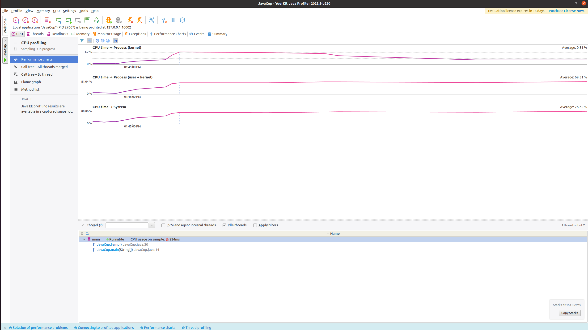
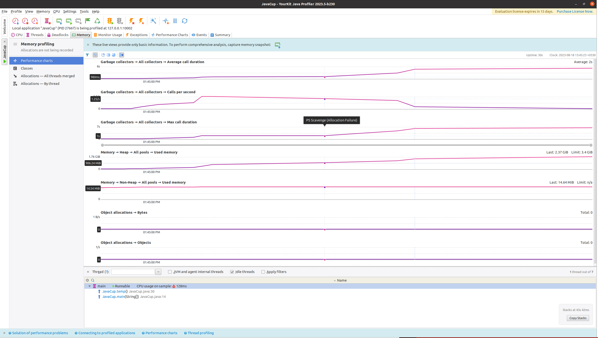
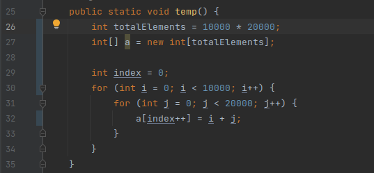
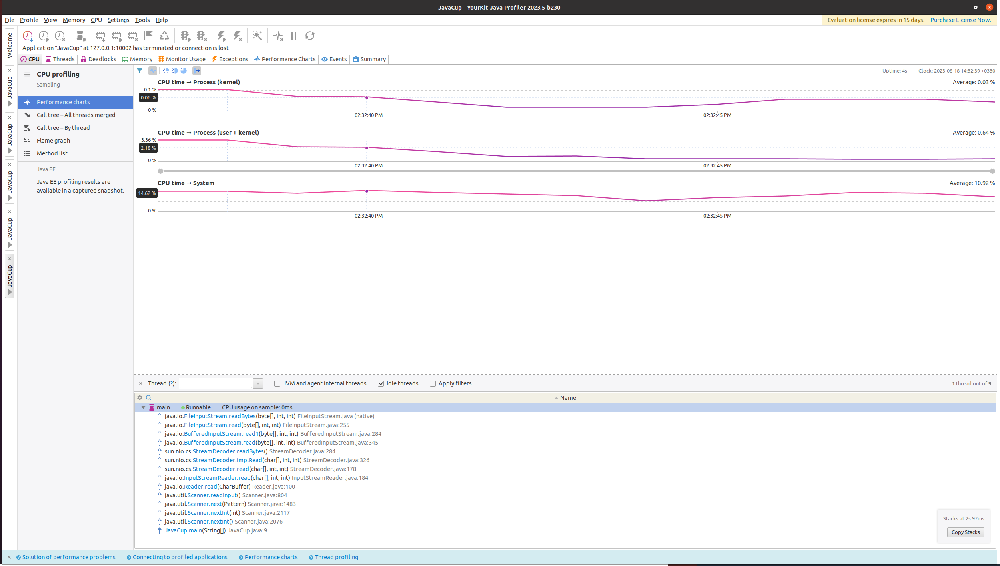
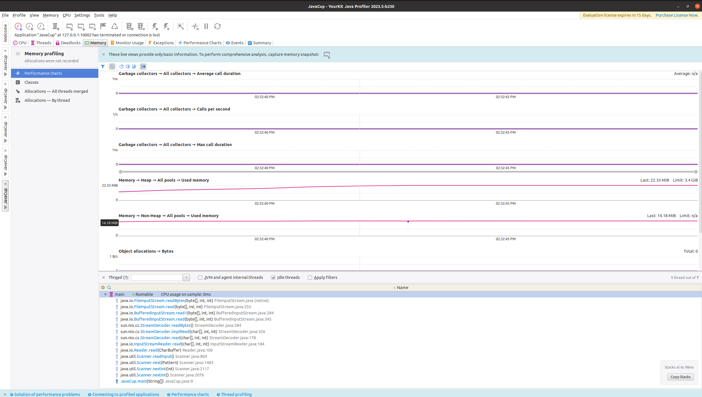
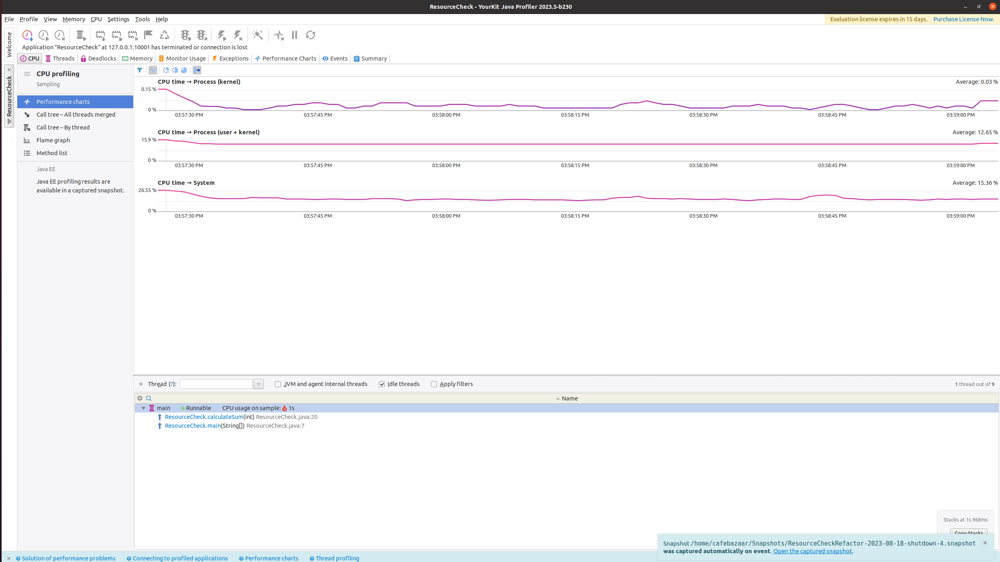
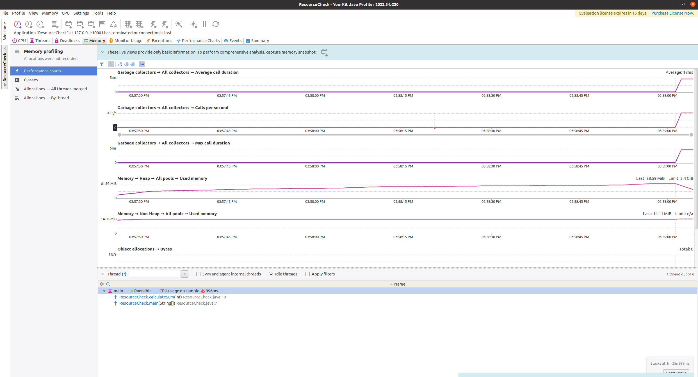
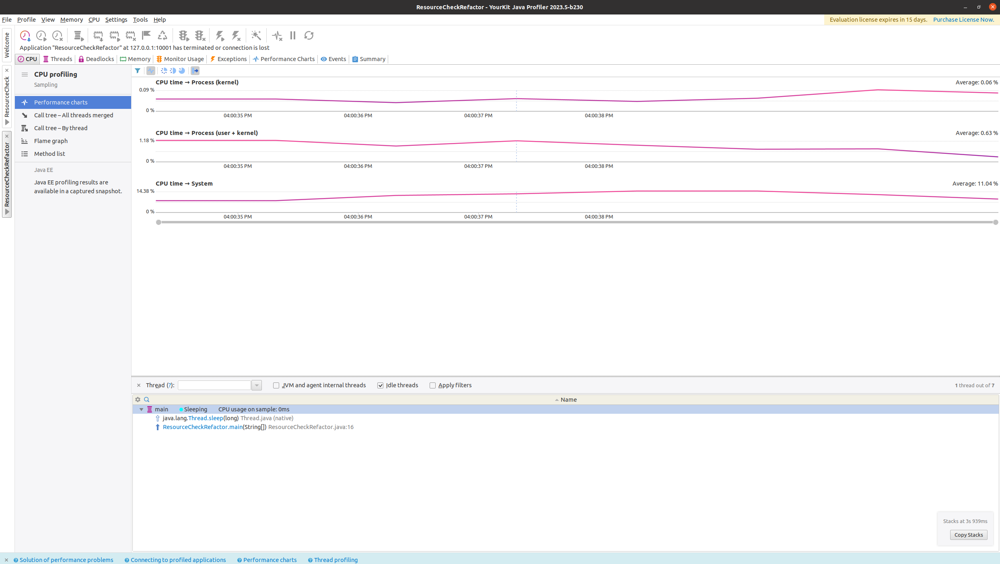
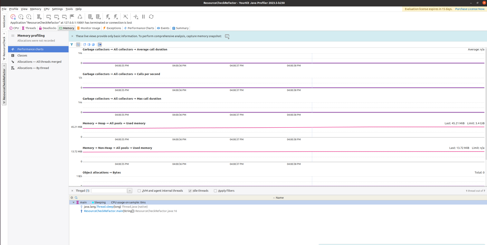

# Lab5

##  داک پروژه پروفایلینگ 

### قسمت اول 
در این قسمت ما به بررسی JavaCup می‌پردازیم. پس از اینکه profiling را روی main این کلاس اجرا کردیم، مشاهده می‌کنیم که cpu در یک قسمت به قله رسیده است. با مشاهده دقیق تر و کلیک کردن روی قسمت پیک نمودار، در پایین صفحه نام تابعی که در حال اجرا بوده است و موجب این مصرف cpu شده است را در می‌یابیم که نامش **temp** است.

در تصویر زیر منابع مصرفی مربوط به cpu است که با کلیک بر قله این نمودار، در پایین صفحه stack این لحظه از اجرا را می‌توانید مشاهده کنید که نام temp در صدر آن موجود است.

تصویر زیر نیز مربوط به مصرف مموری می‌باشد که اگر روی نمودار که روی پیک است، کلیک کنیم، استک برنامه در پایین صفحه نمایش داده می‌شود، که باز هم تابع temp در صدر آن قرار دارد که مشخص می‌کند این مصرف مربوط به این تابع می‌باشد. 

حال با ریفکتور کردن کد و تغییر استفاده از 
آرایه ساده به جای ArrayList توانستیم سرعت اجرا را بسیار زیاد کنیم و در نتیجه آن مصرف منابع به شدت کاهش پیدا کرد.

کد بعد از ریفکتور:

در تصویر زیر مصرف cpu را مشاهده می‌کنیم که پیک در تابع main است و حتی دیگر temp روی پیک نیست و مصرف کل اجرا نیز بسیار کم شده است.

.در تصویر زیر نیز مصرف مموری را مشاهده می‌کنیم که از گیگابایت در حالت قبل به مگابایت رسیده است که نشان دهنده کاهش مصرف مقدار زیادی از مموری است
به طوری که پیک دیگر در تابع temp نیست و روی main می‌باشد.

### قسمت دوم 
در ذیل ProfilingTest/src دو کلاس ResourceCheck و ResourceCheckRefactor گذاشته شده است.
در این قسمت یک برنامه نوشتیم که یک تابع به نام calculateSum دارد و با گرفتن یک عدد مانند n ، مجموع جمع اعداد از ۰تا۱ و ۰ تا۲ و ۰ تا ۳ و ... و ۰ تا n-1 را به ما می‌دهد.

این کار را یک بار در کلاس ResourceCheck انجام دادیم و بار دیگر آن را با استفاده از preprocess در کلاس ResourceCheckRefactor ریفکتور کردیم که مصرف منابع را کاهش دهیم.

قبل از ریفکتور کردن مصرف cpu به شکل زیر بود:

و همچنین مصرف مموری به صورت زیر:

بعد از اینکه ریفکتورینگ را اعمال کردیم مصرف منابع به شدت کاهش پیدا کرد به طوری که در کد ریفکتور مجبور به گذاشتن یک sleep شدیم تا اجرای برنامه کمی طول بکشد و کانکشن با پروفایلینگ قطع نشود و بتوان مصرف منابع را رصد کرد.

مصرف cpu پس از تغییرات به صورت زیر درآمد:

و همچنین مصرف مموری به شکل زیر:

همانطور که می‌بینید مصرف مموری در قسمت قبل حدود ۶۰مگ بود که به ۴۵ مگ کاهش پیدا کرد.
همچنین مصرف cpu نیز در هر سه نمودار به طور چشم گیری کاهش پیدا کرده است.

